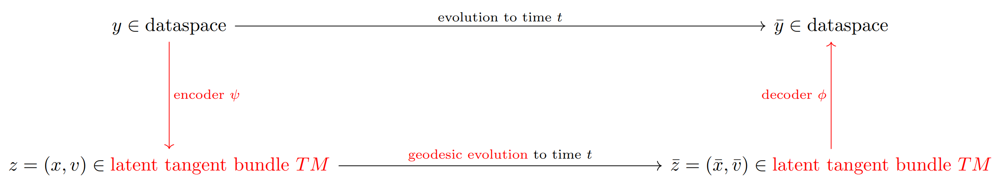

# Neural geodesic flows

Neural geodesic flows (NGFs) are a scientific machine learning model that combines
neural ODEs and computational differential geometry. [This master thesis](https://doi.org/10.3929/ethz-b-000733724),
written by Julian Bürge, supervised through [Dr. Ben Moseley](https://github.com/benmoseley), explains them in detail. We (Bürge, O'Donnell, Moseley) published [this workshop paper on NGFs](https://openreview.net/forum?id=I3VyHmamHB) at EurIps 2025. The project is featured in the [Scalable SciML lab of the Imperial college London](https://scalable-sciml-lab.org/projects/machine-learning-with-geodesic-flows/).

<p align="center">
    
</p>

- [Short explanation](#short-explanation)
- [Getting started](#getting-started)
- [Reproducing the master thesis](#reproducing-the-master-thesis)
- [Citation](#citation)

## Short explanation
NGFs are essentially an autoencoder combined with a neural geodesic ordinary  differential equation ([neural ODEs](https://proceedings.neurips.cc/paper_files/paper/2018/file/69386f6bb1dfed68692a24c8686939b9-Paper.pdf)), as in the following schematic, where the learnable parts are in red.

<p align="center">
    
</p>

We want to learn to predict an evolution in time where a state $y$ at time $0$ evolves to a state $\bar{y}$ at time $t$ according to some unknown law.

NGFs encode the data space to some latent tangent bundle $TM$ of a Riemannian manifold $(M,g)$. The encoded input $y$ becomes a latent location $x$ and velocity $v$ in $TM$. Then a geodesic evolution happens with $x$ as initial location and $v$ as initial velocity until time $t$. Thereby one arrives at the location and velocity $(\bar{x},\bar{v})$ which then get decoded back to the data space, yielding a prediction for $\bar{y}$.

In the current implementation NGFs are realized through a class `TangentBundle_single_chart_atlas` which has the following member variables:
```
dim_dataspace : int   #dimension of the dataspace
dim_M : int           #dimension of the latent M

psi : callable        #encoder dataspace ---> TM, input shape (dim_dataspace,), output shape (2dim_M,)
phi : callable        #decoder TM ---> dataspace, input shape (2dim_M), output shape (dim_dataspace,)
g : callable          #metric tensor on M, input shape (dim_M), output shape (dim_M,dim_M) and required to be a SPD matrix
```
Those are all passed at initialization. Thereby `psi,phi,g` can either be some hard coded functions or any neural network (or any function really, so long as the input-output sizes are correct).

The geodesic equation depends on partial derivatives of the metric tensor $g$ (which `TangentBundle_single_chart_atlas` computes exactly using JAX autodifferentiation), so if `g` is initialized as a neural network it becomes a neural geodesic ODE.

### Properties of NGFs
The theoretical properties of neural geodesic flows include
* They learn an unknown flow through a geodesic flow
* They are automatically [Hamiltonian neural networks](https://greydanus.github.io/2019/05/15/hamiltonian-nns/)
    * Thereby they have perfect time reversibility
    * Thereby they have a conserved quantity, the Hamiltonian = the geodesic energy
* They are automatically [Lagrangian neural networks](https://greydanus.github.io/2020/03/10/lagrangian-nns/)
* If $TM$ is modeled with a multi chart atlas they can extrapolate in time
* The way the make predictions is interpretable

### Current work
In the implementation produced during the master's thesis the latent tangent bundle gets encoded by a single function `psi` which in terms of differential geometry means it uses a single chart atlas. This greatly restricts the complexity of the domain of a dataspace evolution that this NGF implementation can learn. We are therefore working on a multi chart encoder and decoder. [Floryan & Graham 2022](https://doi.org/10.1038/s42256-022-00575-4) have done this very successfully for a latent manifold with a flexible neural ODE (rather than a geodesic one). Until this feature is fully developed it will stay in `experimental/`.

## Getting started

`neural_geodesic_flows` only require Python libraries to run.

> [JAX](https://jax.readthedocs.io/en/latest/index.html) is used as the main computational engine, for its excellent autodifferentiation and vectorization and automatic GPU-use capabilities.

To run the code, we recommend setting up a new Python environment, for example:

```bash
python3 -m venv ngfs-env      #create the environment
source ngfs-env/bin/activate  #activate the environment
```
then cloning this repository:
```bash
git clone https://github.com/julianbuerge/neural_geodesic_flows.git
```
and from the cloned directory installing all requirements:
```
pip install -r requirements.txt
```
If you have a JAX compatible GPU it is much recommended to install the GPU version of JAX instead. The code will run significantly faster. See [the official installation guide](https://docs.jax.dev/en/latest/installation.html).

### On NixOS
If you are on NixOS you can add the dev shell found in [my NixOS configuration](https://github.com/julianbuerge/.mynixos) in `.mynixos/devshells/shell-sciml.nix` or `.mynixos/devshells/shell-scimlcuda.nix` (GPU version of jax) to your `devShells.system` flake outputs. Clone this repository. If you use direnv, adapt '.envrc' so that it can find the shell. Note that if you use the GPU version then upon entering the shell for the first time it will build JAX-Cuda from source which may take a long time.

### Running a minimal example

`python3 -m applications.minimal_example` will train, save and visualize a NGF model. By way of a quick example it is set up to train on a small two sphere dataset with few epochs (so don't expect great performance). If you want to make this model good, increase the dataset size (the file contains 16384 samples), adjust the batch size and the amount of epochs. Once you've explored this a bit you might want to do training and inference separately, or craft your own experiments altogether. You can do so using the modules `applications/general_training.py` and `applications/general_inference.py`, see [Training your own model](#training-your-own-model) below. Some more details on this model:
 * The `.gif` animation above shows how this model trains when using the full dataset
 * The training data are a collection of (up to 16384) geodesic trajectories on the two sphere embedded in 3d consisting of positions (on the sphere) and velocities (tangent to the sphere), so that the data are mathematically 6 dimensional.
 * The model encodes a given 6 dimensional initial point of a trajectory to a 4 dimensional latent tangent bundle (2d manifold with 2d tangents) where it evolves it along a geodesic until time $t=1$. The metric is given by a neural network and so this evolution is learnt. The so obtained geodesic gets decoded into the 6d space.
 * In the inference the difference between the learnt and the given geodesics are analyzed.
 * In this special case, meant as a proof of concept, the data dynamics are themselves geodesic, but in general only the latent evolution is geodesic while the data dynamics are free to be of any kind (see the [master thesis](https://doi.org/10.3929/ethz-b-000733724) for exact assumptions). The goal is to learn any kind of dynamics through re-expressing them as latent geodesic dynamics. Thus, in this simple example we demonstrate that NGFs in the easiest case, where the unknown dynamics are themselves geodesic, successfully solve this learning task.

`applications/analytical_geometry` contains some modules that use the `TangentBundle_single_chart_atlas` code to do computational differential geometry with example functions `psi,phi,g` (no learning involved). Run for instance
```
python3 -m applications.analytical_geometry.two_torus_geodesics
```
to show an example geodesic on the two torus.

### Training your own model
Both modules
```
applications/general_training.py
applications/general_inference.py
```
are set up to do training and inference on a general problem. They use `applications/configs.py` for hyperparameter management and `applications/utils.py` for data loading, model saving and performing the training runs. To run your own problem provide train and test datasets in `data/datasets` of the format
```
dataset.npz with keys 'inputs', 'targets', 'times'
with shapes (many,dim_dataspace),(many,dim_dataspace) and (many,)

or

dataset.npz with keys 'trajectories', 'times'
with shapes (many, trajectory timepoints, dim_dataspace) and (many, trajectory timepoints).
```
and then adapt the train and test dataset names in  `applications/general_training.py` accordingly. In `core/losses.py` there are loss functions for working with trajectory data, since this is the recommended way to learn NGFs. The ability to load input-target data is provided for generalized tasks like classification etc. for which you'll need to provide your own custom loss function. Alternatively, if you want to train standard NGFs using input-target data (not recommended) you will find loss functions in `applications/master_thesis/input_target_losses.py`.

Alternatively, if you want to use NGFs in your own setup, `core/` contains all essential functionality of NGFs as a model without specific setup routines such as data loading, hyperparameter management or model saving.

## Reproducing the master thesis

To reproduce the training or inference of the case studies from the thesis, first set up a new virtual environments with the exact versions of the libraries that were used during the thesis. This can be done with
```bash
python3 -m venv ngfs-thesis-env                             #create the environment
source ngfs-thesis-env/bin/activate                         #activate the environment
pip install -r applications/master_thesis/requirements.txt  #install all libraries
```
Then find the relevant file in `applications/master_thesis/` and run it. For instance
```
python3 -m applications.master_thesis.two_body_problem_inference
```
will produce the numerical and visual results of the two body problem case study as they are shown in the thesis. There are booleans in `toy_problem_inference.py` and `two_body_problem_inference.py` to decide which models are shown.


### Third-party code

In the master thesis we used a Hamiltonian neural network as a baseline for the two body problem. Therefore, this repository includes modified code from the [Hamiltonian Neural Networks](https://github.com/greydanus/hamiltonian-nn) project, located in `applications/master_thesis/HNN/`.
Their code is licensed under the Apache License 2.0 (see `hamiltonian-nn/LICENSE`).

The model in `applications/master_thesis/HNN/trained_hnn.tar` was trained using their module `hamiltonian-nn/experiment-2body/train.py`.


## Citation

If you find Neural geodesic flows useful and use them in your own work, please use the following citation:

```
@mastersthesis{NGF_masterthesis,
  title        = {Neural geodesic flows},
  author       = {Julian B\"urge},
  year         = 2025,
  month        = {March},
  note         = {Published in the ETH research collection at \url{https://doi.org/10.3929/ethz-b-000733724}},
  school       = {ETH Z\"urich},
  type         = {Master thesis}
}
```

### Author
This project is maintained by Julian Bürge. For any questions or comments you can open an issue or reach them at `julian.buerge@alumni.ethz.ch`.
